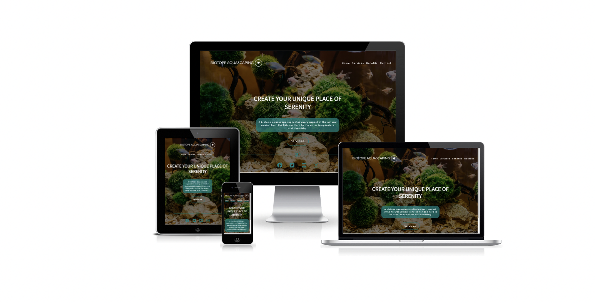
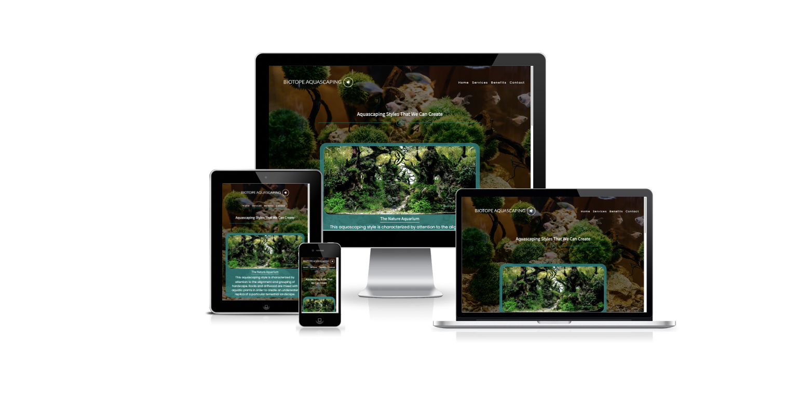
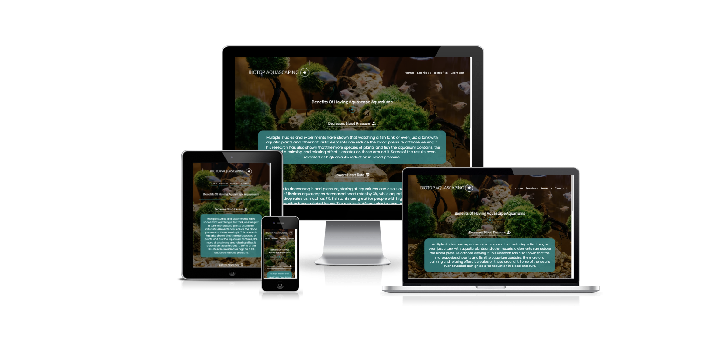
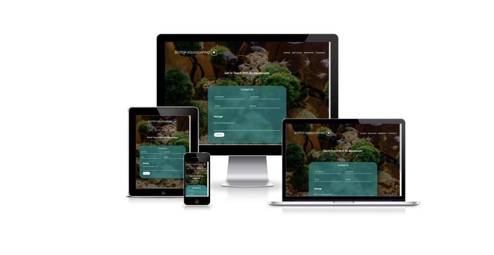

# Biotope Aquascaping
## Milestone Project One
Biotope Aquascaping is a business concept that brings together the love for aquatic plants, nature and fish keeping. Aquascape aquariums are beneficial to physical and mental wellbeing and can have a positive, calming, stress-relieving effect on both their owners and viewers. Bioptope Aquascaping offers their services to rebuild the clients' old aquariums or create new ones in places like private houses, offices, dentist cabinets, restaurants, or wherever the conditions are favorable. Based on years of experience and learning from their mistakes, Biotope Aquascape can design and build clients' future aquariums from the ground up. The purpose of the website is for them to be easily reached and also to share information about them and what they do.
***
## Demo
The live website can be viewed here - [Biotope Aquascaping](https://florindorneanu.github.io/biotope-aquascaping/)

The GitHub repository can be viewed here - [FlorinDorneanu/biotope-aquascaping](https://github.com/FlorinDorneanu/biotope-aquascaping)

***

## User Experience (UX)

## Strategy

### User Stories
#### First Time Visitor Goals
* As a first-time visitor, I want to be able to easily navigate throughout the site to find content;
* As a first-time visitor, I want to easily understand the purpose of the website;
* As a first-time visitor, I want to see pictures with the artwork;
* As a first-time visitor, I want to be able to navigate throughout the site with ease;
* As a first-time visitor, I want the links to function as expected;
