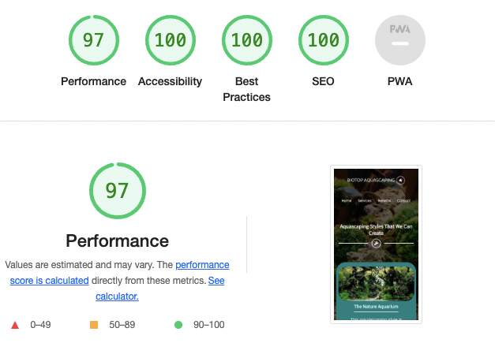

# Biotope Aquascaping
## Milestone Project One
Biotope Aquascaping is a business concept that brings together the love for aquatic plants, nature and fish keeping. Aquascape aquariums are beneficial to physical and mental wellbeing and can have a positive, calming, stress-relieving effect on both their owners and viewers. Bioptope Aquascaping offers their services to rebuild the clients' old aquariums or create new ones in places like private houses, offices, dentist cabinets, restaurants, or wherever the conditions are favorable. Based on years of experience and learning from their mistakes, Biotope Aquascape can design and build clients' future aquariums from the ground up. The purpose of the website is for them to be easily reached and also to share information about them and what they do.
***
## Demo
The live website can be viewed here - [Biotope Aquascaping](https://florindorneanu.github.io/biotope-aquascaping/)

The GitHub repository can be viewed here - [FlorinDorneanu/biotope-aquascaping](https://github.com/FlorinDorneanu/biotope-aquascaping)


***

## User Experience (UX)

## Strategy


### User Stories
#### First Time Visitor Goals
* As a first-time visitor, I want to be able to easily navigate throughout the site to find content;
* As a first-time visitor, I want to easily understand the purpose of the website;
* As a first-time visitor, I want to see pictures with the artwork;
* As a first-time visitor, I want to be able to navigate throughout the site with ease;
* As a first-time visitor, I want the links to function as expected.

### Returning Visitor Goals
* As a returning visitor, I want to find the best way to contact the business;
* As a returning visitor, I want to find the social links with ease.

### Reasons a user may visit the site 
* A user looking to know more about aquascaping;
* A user conducting research on our services;
* A user seeking to beautify their home or workspace;
* A user looking to rebuild the already-existing aquarium;
* A user trying to get in touch with the business.

### Reasons for the website
* Increase clients;
* Provide a way for new and existing clients to contact the business;
* Self-promotion.

## Scope - Functionality
* The site must be easy to navigate around;
* The site should have a simple and visually appealing design;
* The site should function as expected.

## Scope - Content
* Tell the audience about our services;
* Let the audience know about the benefits of biotope aquascaping;
* Make it easy to get in touch by contact form and social media.

## Structure

This website will consists of four pages:
* A Home page, with a small description and a "services" button;
* A Services page which will contain three services that the business has to offer;
* A Benefits page that lists the benefits of having an aquascape aquarium;
* A Contact page with a form to get in touch with "Biotope Aquascaping".


## Skeleton
* Home Page Wireframes - [desktop and mobile](images-readme/home-wireframes.png)
* Services Page Wireframes - [desktop and mobile](images-readme/services-wireframes.png)
* Benefits Page Wireframes - [desktop and mobile](images-readme/benefits-wireframes.png)
* Contact Page Wireframes - [desktop and mobile](images-readme/contact-wireframes.png)

## Surface

### Colour

This website was requested to have a simple yet visually appealing design. To keep up with the request, two colours were used throughout the site: Teal(#008080) and White(#FFF). These colours go perfect with the aquatic theme that was chosen.

### Imagery

The images chosen for the "Services" page were taken from [this website](https://aquascapinglove.com/learn-aquascaping/aquascaping-styles/) to showcase exactly what every type of decorated aquarium could look like for the users to get not only readble information but also a visual example. The background image(banner image) was taken from [Envato](https://elements.envato.com/photos/) and it was chosen for the nice contrast and to to keep up with the theme of the website.

### Typography

For fonts, https://fonts.google.com/ has been used. For headings, "Source Sans Pro" has been chosen and for the content, "Poppins" font was chosen because it goes perfectly with the "Source Sans Pro" font and it gives the website a modern and playful vibe. Letter spacing was increased in some places to make the text more defined and to stand out.

This code was imported at the top of the style.css file:
```
@import url('https://fonts.googleapis.com/css2?family=Poppins:wght@300&family=Source+Sans+Pro&display=swap');
```

### Call to Action
* The navigation bar in the header section is highlighted with a nice hover effect: an underline that starts from the left side and goes for 0.4 seconds to the right side when the mouse is hovered over them.
* On the Home page, a "Services" button has been added for the user to easily access it when entering the website. For consistency reasons, the button also has a hover effect, covering the button background with the color "Teal" from the left side to the right side for 0.4 seconds.
* The "Send" button from the contact form was styled white with black text for contrast purposes.
* The colour "Teal" was used for styling the social links. The media links will send the user to "Biotope Aquascaping" social media pages.
***
## Features
### Navigation Bar and Logo
The navigation bar and logo are set at the top of the webpage. The navigation links are highlighted when hovered over. When clicked, the logo sends the user to the home page. The navigation links take the user to the correct page of the website. For the larger screens, the logo is placed in the top left corner of the webpage and the navigation is in the top right corner of the webpage. On smaller screens, the navigation bar goes under the logo and both elements are centered.

### Responsiveness
The website is responsive at all breakpoints. The page layout will change to something more suited to smaller devices when needed. This has been achieved using media queries. This is to make the site easier to use for people with visual impairments by allowing them to navigate the site easily.

### Accessibility 
Alt-attribute and aria-label have been added to every image and navigation link. Header elements have been used in sequence so that the site makes semantic sense to screen readers. High contrast has been used throughout the design.

### Footer
The footer contains the social links for [Facebook](https://www.facebook.com/), [Twitter](https://twitter.com/), [Youtube](https://www.youtube.com/) and [Instagram](https://www.instagram.com/).

### Home Page
Features an inviting heading, a small description and a "Services" button. All of them are positioned in the center of the page.

### Services Page
A heading is placed at the top of the page. Underneath the heading, an icon is set inside a circle designed with two lines by its sides. Moving further, this page consists of three types of aquascaping styles that the business can provide. An image and a description of every type of aquarium are set at each one of them. As this is a fictive business created for the Milestone Project One, the images were taken from [this website](https://aquascapinglove.com/learn-aquascaping/aquascaping-styles/) and the descriptions were inspired by [this website](https://aquascapinglove.com/learn-aquascaping/aquascaping-styles/).

### Benefits Page
As in the "Services" page, heading is placed at the top of the page, having the same style underneath. This page contains four benefits of aquascape aquariums. Every benefit has a description of it. In the "Reduces Axiety" section an hyperlink for a study is provided so that the user can learn even more from there. On the right side of each benefit title, a specific icon can be found. The text content was taken from [this link](https://buceplant.com/blogs/aquascaping-guides-and-tips/the-benefits-of-aquariums-on-health-and-mood).

### Contact Page
Consists of:
* A contact form;
* The form includes fields for the user to enter their business name and contact details using - input type="text";
* The email input field requires the answer to be an email;
* The "Mobile" input field must be a number to be valid;
* There is a - textarea - to allow the user to ask any further details. I have used placeholder text to encourage the user to make any further comments;
* The submit button has high contrast;
* The form is stacked for mobile use;
* All fiels are set to "required".
***

## Technologies Used
* HTML5 - Mark-up language using semantic structure.
* CSS3 - Cascading style sheet used for styling.
* Gitpod.io - For writing the code, using the command line for commiting and pushing to GitHub.
* GitHub - Used to host the repository.
* Git - Used for version control of the project.

### Design
* [Google fonts](https://fonts.google.com/) - For styling the typography.
* [Balsamiq wireframe](https://balsamiq.cloud/) - To build wireframes in the design phase.
* [Font Awesome](https://fontawesome.com/) - For the social media icons.
* [Beautifier](https://beautifier.io) - To beautify my code.
* [Tiny PNG](https://tinypng.com/) - To compress my images.
* [Online-Convert](https://image.online-convert.com/convert-to-webp) - To convert my images to WebP.

### Testing
* [HTML Validator](https://validator.w3.org/#validate_by_input) - Testing validity of HTML.
* [CSS Validator](https://jigsaw.w3.org/css-validator/) - Testing validity of CSS.
* [Am I Responsive](https://ui.dev/amiresponsive#) - Checking the responsive nature and creating the mock-ups provided.
* [HTML Validator](https://validator.w3.org) - To validate the HTML.
* [CSS Validator](https://jigsaw.w3.org/css-validator/) - To validate the CSS.
* DEV Tools - Lighthouse.
***

## Testing
* Tested that the logo sends the user to the home page.
* Tested if the user is sent to the correct page of the website when clicking the navigation links.
* Tested that the "Services" button works.
* Tested that the "Send" button works.
* Attempting to submit the form without required fields results in a browser error message.
* Attempting to submit the form with an email that doesn't contain the appropriate tokens results in a browser error message.
* Submitting the form with all the correct information provided, sends the user to the Code Institute form dump, which displays data from all the fields.
* Clicking on the social media links in the footer results in the browser navigating to the appropriate social media site in a new browser tab.
* Tested if the hyperlink send you to the specific webpage.

[HTML Validator](https://validator.w3.org)


[CSS Validator](https://jigsaw.w3.org/css-validator/)


***

### Performance Testing

Tested using the Developer Tools Lighthouse for desktop and mobile :

### Desktop


### Mobile




### Browser Compatibility

The website was tested on the following browsers:
* Google Chrome, on desktop and mobile;
* Safari, on desktop and mobile;
* Mozilla Firefox, on desktop and mobile.

### OS Compatibility

Tested on iOS, macOS and Android. Chrome Developer Tools was used for testing the responsiveness.

### Testing User Stories

* A user looking to know more about aquascaping;

The user can easily find more about aquascaping in the small description on the "Home" page, in the "Services" page as well as in the "Benefits" page.

* A user conducting research on our services;

The user can find information about what kind of aquascaping styles the business can provide, on the "Services" page.

* A user seeking to beautify their home or workspace;

The user can choose between three types of aquascaping styles to beautify their home or workspace on the "Services" page.

* A user looking to rebuild the already-existing aquarium;

The user can contact the business to establish a future aquarium rebuilding using the contact form provided in the "Contact" page.

* A user trying to get in touch with the business.

The user can get in touch simply by using the contact form provided in the "Contact" page or the social media links located at the bottom of the page, in the footer section.
***

## Deployment

### Delpoying to GitHub Pages

The project was deployed with the following steps

* Log into GitHub;
* Click the "Settings" button in the menu above the Repository;
* Scroll down the Settings page to the "GitHub Pages" Section;
* Under "Source", click the dropdown called "None" and then select "Master Branch";
* The page will automatically refresh, and a link displaced. It may take some time for the link to show the website.
* If the page will not load go down to "template" under the "source" and select a template.
* Scroll back down through the page to locate the now published site link in the "GitHub Pages" section.

### Forking

Forking the GitHub Repository

By forking the GitHub Repository, you can make a copy of the original repository in your own GitHub account. This means we can view or make changes without making the changes affecting the original.

* Log into GitHub and locate the GitHub Repository;
* At the top of the Repository there is a "Fork" button about the "Settings" button on the menu;
* You should now have a new copy of the original repository in your own GitHub account.

### Cloning
 
 Taken from GitHub's documentation on cloning, which can be found [here](https://docs.github.com/en/repositories/creating-and-managing-repositories/cloning-a-repository#cloning-a-repository-to-github-desktop) :
 
* Once logged into GitHub, navigate to the repository you wish to clone.
* Next to the green Gitpod button there's a button that reads code, click this.
* To clone the repository using HTTPS, copy the link whilst HTTPS is selected.
* Open your local IDE of choice and open the terminal.
* Navigate to the working directory of where you want the cloned directory to be.
* Type ```git clone``` in the terminal and then paste the link that you selected in step 3. Press enter.
* The clone is created in your current working directory (```cwd```).

### Adding and commiting files

I’ve been using Gitpod to write my code and using the terminal within to add, commit and push code from my workspace to GitHub where it is stored remotely as shown in the course content.

* When I have made a couple of minor additions / changes or one large change or addition I add the file in question to the staging area by typing in the terminal git add . the full stop will add all new files.
* I now want to save my changes to the local repository by typing git commit –m “ ” into the terminal. Between the “ ” I'll write a concise message detailing what this commit has done.
* When I either want to upload all my changes for the day or view on GitHub Pages I push all the commits I’ve previously done to GitHub using the git push command. When GitHub Pages is set up for the repository in question it will automatically pick up these changes and display the most up to date version that has been pushed.
***

## Known Bugs
* BUG - When testing the responsiveness using DevTools, there were no bugs identified. When tested on Safari on desktop and all the browsers on mobile, The ```text-decoration: underline``` for the h2 heading on the "Services" and "Benefits" pages, the line didn't appear. This was fixed by replacing ```text-decoration: underline``` with ```border-bottom```.
* BUG - On mobile, using Firefox, Safari and Chrome, the button "Send" from the contact form wasn't centered. This was fixed by using ```margin-left: auto```, ```margin-right: auto``` and increasing the size of the button.

## Acknowledgements
### Credit
* [Code Institute SampleREADME](https://github.com/Code-Institute-Solutions/SampleREADME)
* [W3schools](https://www.w3schools.com) - for various code information.
* [Balsamiq wireframes](https://balsamiq.cloud/) - To build wireframes in the design phase.
* [Envato](https://elements.envato.com/photos/) - For the banner image used on the website.
* [Beautifier](https://beautifier.io) - To beautify my code.
* [Tiny PNG](https://tinypng.com/) - To compress my images.
* [Online-Convert](https://image.online-convert.com/convert-to-webp) - To convert my images to WebP.
* [HTML Validator](https://validator.w3.org) - Testing validity of HTML.
* [CSS Validator](https://jigsaw.w3.org/css-validator/) - Testing validity of CSS.
* [Am I Responsive](https://ui.dev/amiresponsive#) - Checking the responsive nature and creating the mock-ups provided.
* [Logo](https://logo.com/) - Making the logo for the website.
* [Buceplant](https://buceplant.com/blogs/aquascaping-guides-and-tips/the-benefits-of-aquariums-on-health-and-mood) - The hyperlink and text content from the "Benefits" page was taken from this website.
* [Aquascaping Love](https://aquascapinglove.com/learn-aquascaping/aquascaping-styles/) - The images and text content from the "Services" page was taken from this website.

## Code

The code used for creating the Home page was taken from [this youtube link](https://www.youtube.com/watch?v=PgAZ8KzfhO8&t=368s) and customised for the needs of the website.

For making the lines and circle under the headings on Services, Benefits, Contact pages and Footer [this code was used](https://www.youtube.com/watch?v=mjDek0d1kak).

[This code](https://www.youtube.com/watch?v=WwdU_eDKeVQ&t=5s) was used for creating the contact form.


